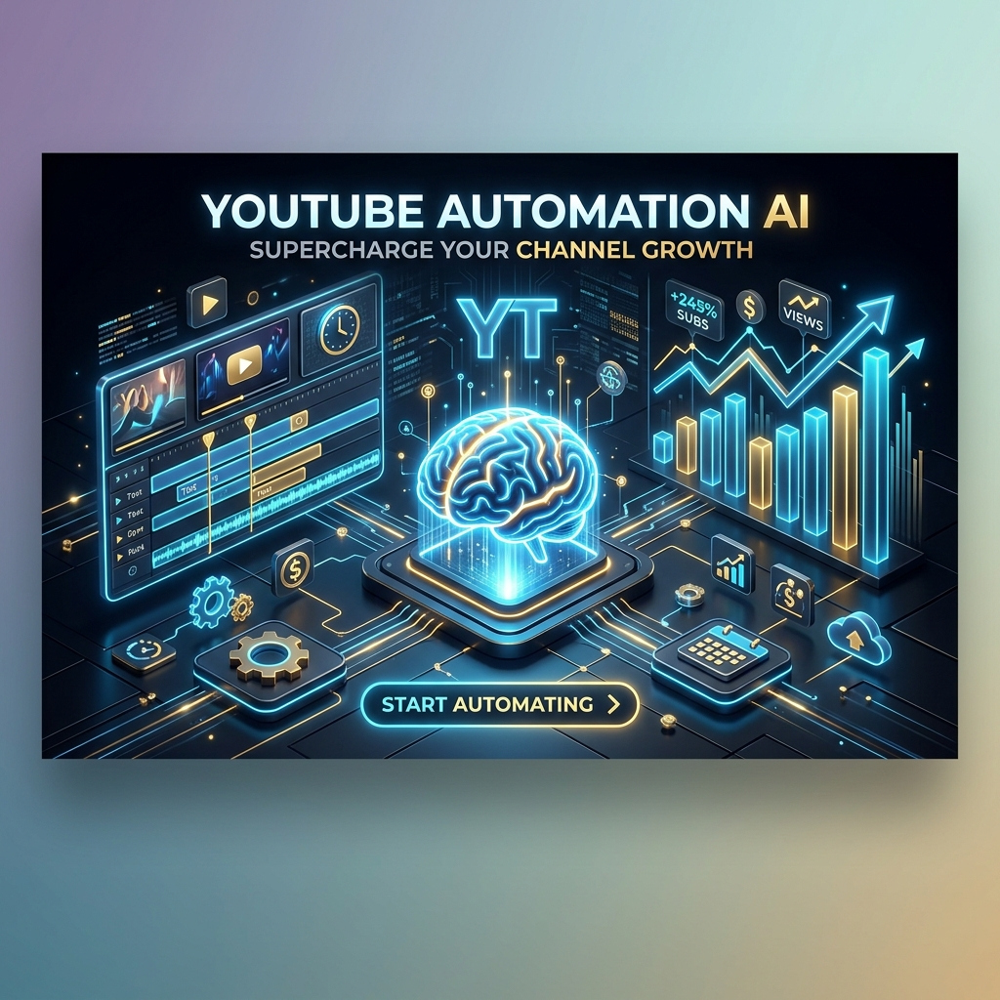

<p align="center">
  
</p>

<h1 align="center">🎥 YT Faceless Factory</h1>

<p align="center">
  <strong>Automating the production of high-retention financial documentaries.</strong>
</p>

<p align="center">
  
  
  
  
</p>

---

## 🚀 Overview
**YT Faceless Factory** is a multi-stage production pipeline designed to clone the success of channels like *ClearValue Tax*. It automates everything from viral trend analysis to final video assembly.

### ✨ Key Features
- 🧬 **Viral DNA Extraction**: Advanced scraping and analysis of competitor transcripts.
- ✍️ **Engaged Scriptwriting**: AI-driven narratives focused on retention loops and blunt "news-style" hooks.
- 🖼️ **Cinematic Asset Generation**: Automated 16:9 photorealistic image generation via Gathos API.
- 🎙️ **High-Fidelity Voiceover**: Professional TTS with custom-cloned financial voices.
- 🎬 **Automated Montage**: Seamless assembly of clips, transitions, and background music.

## 🧠 What does this do?
**YT Faceless Factory** is an automated video production engine. It transforms raw ideas or existing channel styles into fully-rendered, high-retention YouTube videos. The pipeline handles:
- **Analysis**: Extracts the "Viral DNA" from successful channels.
- **Creation**: Writes scripts, generates photorealistic images, and creates professional voiceovers.
- **Assembly**: Combines all assets with transitions and background music into a final 1080p MP4.

### 📽️ Content Type: General-Purpose Framework
While the current configuration is optimized for **financial documentaries** (high-retention, news-style hooks), this is a **general-purpose framework**. It can be used to create:
- 📈 Financial & Business explainers
- 🧪 Science & Technology documentaries
- 📚 Educational tutorials
- 🎭 Storytelling & "What if" scenarios
- 🎮 Gaming & Pop culture updates

## 🤖 Agent Information
This project is designed to be **AI-Agent Ready**. It includes a comprehensive `AGENT_GUIDE.md` that allows AI assistants to:
- **Operate the Pipeline**: Agents can run analysis, script generation, and assembly autonomously.
- **Two Operational Modes**:
  1. **Channel Clone Mode**: Follow a specific channel's rhythm and hook structure.
  2. **Script Folder Mode**: Batch process a folder of markdown scripts into videos.
- **Standardized state tracking**: Agents use `state/<run_id>.json` to monitor progress and handle retries.

## 🌟 Why this is useful?
- **Infinite Scalability**: Produce high-quality content 24/7 without a camera or microphone.
- **Viral Consistency**: By cloning the "DNA" of successful channels, you ensure your content follows proven retention patterns.
- **Cost Efficiency**: Automates the work of a scriptwriter, narrator, editor, and graphic designer.
- **Creative Freedom**: Focus on strategy and topics while the agents handle the manual labor of production.

## 🎬 Demo
Check out a sample video generated with this pipeline:
[📺 Watch Sample Video on Google Drive](https://drive.google.com/file/d/1spWTY0UrOPTYDHevKPh1zwIpph7OVlQb/view?usp=sharing)

## 🛠️ Tech Stack
| Component | Technology |
| :--- | :--- |
| **Logic** |  |
| **Video Processing** |  |
| **Data Fetching** |  |
| **Environment** |  |

## 📦 Setup & Installation

### 1️⃣ Clone & Prepare
```bash
git clone https://github.com/DataSpieler12345/faceless-youtube-agents.git
cd faceless-youtube-agents
python -m venv .venv
.\.venv\Scripts\activate
pip install -r requirements.txt
```

### 2️⃣ Configure Secrets 🔑
Create a `.env` file in the root. **This file is ignored by Git.**
```env
GATHOS_IMAGE_API_KEY=your_key
GATHOS_TTS_API_KEY=your_key
ZERNIO_API_KEY=your_key
```

## 🎯 How to Run
To generate a full video from a topic:
```bash
python pipeline.py --run-id "inflation-2026" --run-all
```

---
## 👤 Author
**DataSpieler12345** - *Main developer and project lead*

## 🤝 Credits
This project was inspired by and built upon frameworks developed by [yashaiguy-dev](https://github.com/yashaiguy-dev). Special thanks for the architectural insights.

<p align="center">
  <i>Developed with ❤️ for the next generation of automated content creators.</i>
</p>
